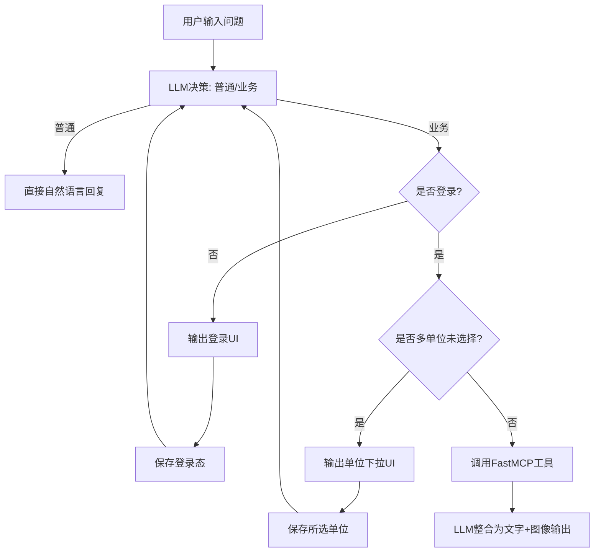

# 消防业务对话 Agent（Python, LLM编排 + FastMCP）

## 目标
实现一个支持多轮会话的 Agent：
- 普通对话
- 消防业务查询（由大模型判断是否需登录/单位选择）
- 前置条件完成后自动继续回答“原始业务问题”（无需用户再次提交）
- 输出形态为“文字描述 + 图像并存”

## 架构说明（模块不过度拆分）

### 1) `agent_core.py`：Agent 编排核心
- `llm_decide(question, state)`：模拟大模型决策，判断普通对话/业务问题，以及是否要登录、是否要单位选择。
- `llm_compose_answer(...)`：将 MCP 结果组织成自然语言叙述 + 图像指令（不是固定字段填充回复）。
- `UserState`：会话登录态、单位信息、所选单位。

### 2) `mcp_server.py`：标准 FastMCP 服务层 + 模拟数据
- 使用 `FastMCP` 注册工具（若环境未安装 fastmcp，可退化为本地函数调用）。
- 提供 4 个业务工具：
  - 火警数量
  - 平面图
  - 未闭环隐患数量（新增）
  - 设备在线率（新增）

### 3) `app.py`：对话 UI 与流程驱动（Streamlit）
- 多轮聊天历史持续保留。
- 业务问题触发时：
  1. 模型判断需要登录 -> 输出登录框（用户名/密码/登录按钮）
  2. 模型判断多单位未选择 -> 输出单位下拉选择
  3. 前置条件达成后自动续答 `pending_question`
  4. 自动续答时会显示明确提示（“正在自动继续处理原问题”）；登录与单位选择由持久化流程阶段控制，不依赖 submit 瞬时值跨轮保留；阶段切换后会主动 rerun 立即刷新到下一步 UI
- 数量类/在线率展示图表，平面图展示示意图。

## 整体流程图



## 示例测试问题列表（保留）
1. 你好，帮我总结今天工作
2. 查询单位的火警数量
3. 查询单位的平面图
4. 查询单位未闭环隐患数量
5. 查询单位消防设备在线率
6. 刚才的结果还有什么风险建议？

## 运行
```bash
pip install -r requirements.txt
streamlit run app.py
```

## 测试
```bash
pytest -q
```
