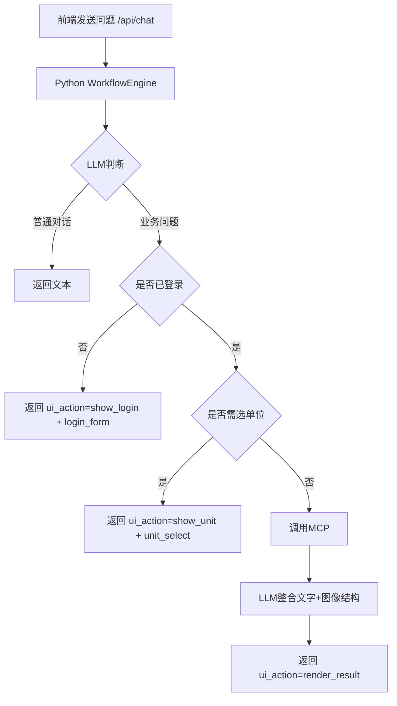

# 消防业务对话 Agent（前后端分离：Python 流程引擎 + 任意前端）

## 要求（逐条对应）
1. **普通对话不需要登录**：普通聊天直接返回文本，不触发登录 UI。  
2. **业务问题需要登录**：由 Python 流程引擎判断业务意图，返回 `show_login`。  
3. **登录/单位下拉交互在对话框中按需显示**：交互表单嵌入在助手同一条回复中。  
4. **前端仅提供对话与交互 UI**：不保存流程判断，不写业务分支规则。  
5. **LLM 决策是否使用 UI 以及使用什么 UI**：后端 `llm_decide + workflow_engine` 决策并返回 `ui_action` + `extra.ui`。  
6. **执行流程框架用 Python 开发**：登录校验、单位选择、自动续答原问题、MCP 调用全在 Python 后端。  

## 架构

### 1) `workflow_engine.py`（核心流程引擎，Python）
- 会话级状态：登录态、单位、挂起问题、历史消息。
- 统一流程入口：
  - `process_chat`
  - `login`
  - `select_unit`
- 后端返回 `ui_action`（如 `show_login` / `show_unit` / `render_result`）以及 `extra.ui`，前端只根据动作渲染。

### 2) `backend_api.py`（Python API 层）
- 基于 FastAPI 暴露接口：
  - `POST /api/session`
  - `POST /api/chat`
  - `POST /api/login`
  - `POST /api/select-unit`
  - `GET /api/state/{session_id}`
- API 不做业务编排，仅把请求交给 `workflow_engine.py`。

### 3) `frontend/`（前端示例）
- `index.html` + `app.js` + `styles.css`。
- 仅负责：消息展示；并把登录框、单位下拉、图表都渲染在助手同一条消息内。
- 可替换为 React/Vue/任意 Web 前端，流程无需改动。

### 4) 业务与模型
- `agent_core.py`：LLM 决策与答案组织。
- `mcp_server.py`：FastMCP 工具模拟（火警数量/平面图/隐患/在线率）。

## 流程图



## 运行

### 启动后端（Python 控制流程）
```bash
uvicorn backend_api:app --host 0.0.0.0 --port 8000 --reload
```

### 启动前端示例（静态）
```bash
python -m http.server 5500 --directory frontend
```

浏览器打开 `http://127.0.0.1:5500`。

## 测试
```bash
pytest -q
```
